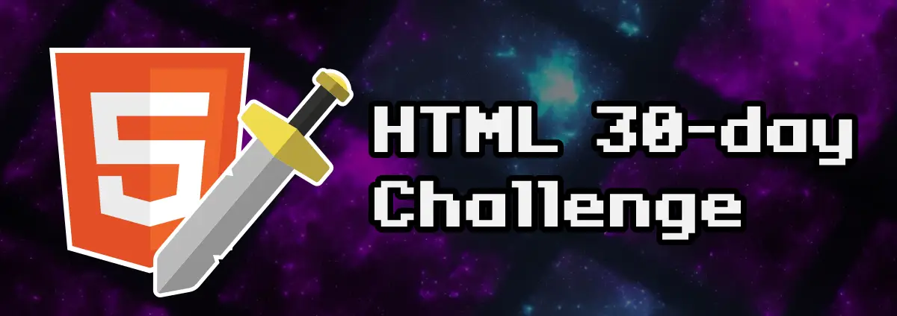

# HTML 30-day challenge by ManzDev

Este repo contiene la solución a una serie de [desafíos](https://lenguajehtml.com/challenge/) creados por [ManzDev](https://manz.dev) con la finalidad de aprender y/o practicar con los lenguajes HTML, CSS y un poco de JavaScript.

> Estos desafíos los estoy resolviendo en vivo en mi [canal de twitch](https://twitch.tv/odracirdev), si quieres ver cómo los resuelvo en vivo te invito a seguirme. También puedes ver el calendario con todos los directos en tu hora local accediendo a mi [servidor de discord](https://discord.gg/3m9KdYAf3p).

## Lista de desafíos resueltos

 - [Día 1](./01/index.html): Crea una página HTML con código CSS desde un archivo diferente.
 - [Día 2](./02/index.html): Crea una página con un titular, varios párrafos de texto y una imagen.
 - [Día 3](./03/index.html): Construye una página con un párrafo que tenga enlaces internos y externos (a otros sitios web).
 - [Día 4](./04/index.html): Valida el código HTML de tus ejemplos anteriores (y los siguientes a partir de ahora).
 - [Día 5](./05/index.html): Ponle un título y una descripción al documento, ideal para SEO.
 - [Día 6](./06/index.html): Crea un grupo de secciones (acordeón) donde se despliegue sólo uno a la vez.

### Lista de desafíos pendientes

 - Día 7: Coloca una imagen en formato JPEG-XL. Si el navegador no la soporta, que use AVIF. Sino, que use JPG.
 - Día 8: Crear un párrafo de texto con palabras destacadas en diferentes colores.
 - Día 9: Crea un pergamino con una lista de objetos, donde se numere con números romanos (mayúsculas).
 - Día 10: Inserta un video de Youtube en una página y estila con CSS para que se vea bien.
 - Día 11: Escribe un texto con super/subíndices (fórmulas químicas, por ejemplo).
 - Día 12: Crea un slider que permita seleccionar un número entre 1-50 y lo muestre en vivo al cambiar.
 - Día 13: Crea una barra medidora que muestre los tickets vendidos en un cine (64/100 tickets vendidos).
- Día 14: Muestra un bloque de fragmento de código CSS en una página (sin resaltado de colores).
- Día 15: Crea una página con un video MP4, que muestre una portada antes de darle a reproducir.
- Día 16: Muestra un texto con el atajo de teclado CTRL+ALT+SUPR y dale estilo para que parezcan teclas.
- Día 17: Crea una card de usuario: username como título, un avatar, edad, país, nacimiento y enlace a su web.
- Día 18: Crea un pequeño artículo de prensa con una noticia inventada. Usa etiquetas HTML semánticas.
- Día 19: Crea una tabla con información. Incluye una cabecera y un pie de tabla. La última columna será de un color diferente.
- Día 20: Crea un formulario para dejar un comentario en una página: Usuario y comentario de texto.
- Día 21: Crea una lista desplegable donde se pueda seleccionar entre 3 grupos de productos ficticios.
- Día 22: En la lista anterior, permite al usuario introducir opciones personalizadas y filtrar de datos.
- Día 23: Crea un formulario que te permita elegir un día entre el 15/nov y el 15/dic.
- Día 24: Crea un formulario de registro que valide si el username escrito es válido (sólo letras y números) o no.
- Día 25: Crea una galería de fotos. Asegúrate que no se cargan si están fuera de la región visible del navegador.
- Día 26: Crea un mensaje emergente al pulsar un botón, que desaparezca al pulsar fuera del mensaje.
- Día 27: Crea una serie de etiquetas que permitan mostrar como miniatura una imagen en redes sociales.
- Día 28: Crea una ventana modal que bloquee la interación con otros botones. Requiere un poco de Javascript.
- Día 29: Crea un sistema de pestañas (tabs) para mostrar información. Necesita algo de Javascript.
- Día 30: Carga una librería Javascript de confetti y lánzalo cuando pulses en un botón. Requiere algo de Javascript.