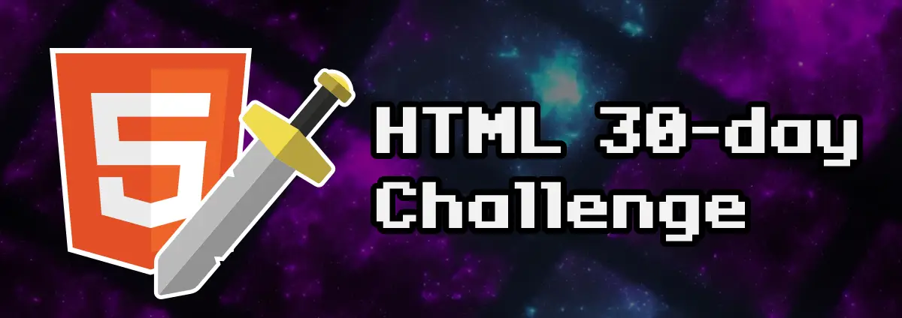

# HTML 30-day challenge by ManzDev

Este repositorio contiene la solución al ["HTML 30-day Challenge"](https://lenguajehtml.com/challenge/) creado por [ManzDev](https://manz.dev) con la finalidad de aprender y/o practicar con los lenguajes HTML, CSS y un poco de JavaScript.

> [!IMPORTANT]
> Estos desafíos los resuelvo en vivo en mi canal de twitch, si quieres ver cómo lo hago te invito a seguirme. También puedes ver el calendario con todos los directos en tu hora local accediendo a mi servidor de discord.

> [!NOTE]
> Por ahora las soluciones solo tienen el código necesario para pasar cada una de las pruebas, mi idea es que cuando termine con los 30 desafíos poder hacer un refactor completo de todos y convertirlos en mini proyectos.

## Lista de desafíos

| Día | Desafío | Solución |
|-----|---------|----------|
|01| ✅ Crea una página HTML con código CSS desde un archivo diferente. | [🔗](https://odracirdev.github.io/challengeHTML/desafios/01/index.html) |
|02| ✅ Crea una página con un titular, varios párrafos de texto y una imagen. | [🔗](https://odracirdev.github.io/challengeHTML/desafios/02/index.html) |
|03| ✅ Construye una página con un párrafo que tenga enlaces internos y externos (a otros sitios web). | [🔗](https://odracirdev.github.io/challengeHTML/desafios/03/index.html) |
|04| ✅ Valida el código HTML de tus ejemplos anteriores (y los siguientes a partir de ahora). | [🔗](https://odracirdev.github.io/challengeHTML/desafios/04/index.html) |
|05| ✅ Ponle un título y una descripción al documento, ideal para SEO. | [🔗](https://odracirdev.github.io/challengeHTML/desafios/05/index.html) |
|06| ✅ Crea un grupo de secciones (acordeón) donde se despliegue sólo uno a la vez. | [🔗](https://odracirdev.github.io/challengeHTML/desafios/06/index.html) |
|07| ✅ Coloca una imagen en formato JPEG-XL. Si el navegador no la soporta, que use AVIF. Sino, que use JPG. | [🔗](https://odracirdev.github.io/challengeHTML/desafios/07/index.html) |
|08| ✅ Crear un párrafo de texto con palabras destacadas en diferentes colores. | [🔗](https://odracirdev.github.io/challengeHTML/desafios/08/index.html) |
|09| ✅ Crea un pergamino con una lista de objetos, donde se numere con números romanos (mayúsculas). | [🔗](https://odracirdev.github.io/challengeHTML/desafios/09/index.html) |
|10| ✅ Busca 5 videos de youtube. Inserta uno en la página. Haz que se pueda cambiar entre ellos como una TV. Dale estilo con CSS para que se vea más bonito. | [🔗](https://odracirdev.github.io/challengeHTML/desafios/10/index.html) |
|11| ✅ Escribe un texto con super/subíndices (fórmulas químicas, por ejemplo). | [🔗](https://odracirdev.github.io/challengeHTML/desafios/11/index.html) |
|12| ✅ Crea un slider que permita seleccionar un número entre 1-50 y lo muestre en vivo al cambiar. | [🔗](https://odracirdev.github.io/challengeHTML/desafios/12/index.html) |
|13| ✅ Crea una barra medidora que muestre los tickets vendidos en un cine (64/100 tickets vendidos). | [🔗](https://odracirdev.github.io/challengeHTML/desafios/13/index.html) |
|14| ✅ Muestra un bloque de fragmento de código CSS en una página. Si quieres ir al máximo, añade una librería Javascript para añadirle resaltado de colores. | [🔗](https://odracirdev.github.io/challengeHTML/desafios/14/index.html) |
|15| ✅ Crea una página con un video MP4 (no de youtube), que muestre una imagen de portada antes de darle a reproducir. | [🔗](https://odracirdev.github.io/challengeHTML/desafios/15/index.html) |
|16| ✅ Muestra un texto con el atajo de teclado CTRL+ALT+SUPR y dale estilo para que parezcan teclas. | [🔗](https://odracirdev.github.io/challengeHTML/desafios/16/index.html) |
|17| ✅ Crea una card de usuario: username como título, un avatar, edad, país, nacimiento y enlace a su web. | [🔗](https://odracirdev.github.io/challengeHTML/desafios/17/index.html) |
|18| ✅ Crea un pequeño artículo de prensa con una noticia inventada. Usa etiquetas HTML semánticas. | [🔗](https://odracirdev.github.io/challengeHTML/desafios/18/index.html) |
|19| ✅ Crea una tabla con información. Incluye una cabecera y un pie de tabla. La última columna será de un color diferente. | [🔗](https://odracirdev.github.io/challengeHTML/desafios/19/index.html) |
|20| ✅ Crea un formulario para dejar un comentario en una página: Usuario y comentario de texto. | [🔗](https://odracirdev.github.io/challengeHTML/desafios/20/index.html) |
|21| ✅ Crea una lista desplegable donde se pueda seleccionar entre 3 grupos de productos ficticios. | [🔗](https://odracirdev.github.io/challengeHTML/desafios/21/index.html) |
|22| ✅ En la lista anterior, permite al usuario introducir opciones personalizadas (no sólo las de la lista) y filtrar las opciones existentes. | [🔗](https://odracirdev.github.io/challengeHTML/desafios/22/index.html) |
|23| ✅ Crea un formulario que te permita elegir un día entre el 15/nov y el 15/dic. | [🔗](https://odracirdev.github.io/challengeHTML/desafios/23/index.html) |
|24| ✅ Crea un formulario de registro que valide si el username escrito es válido (sólo letras y números) o no. | [🔗](https://odracirdev.github.io/challengeHTML/desafios/24/index.html) |
|25| Crea una galería de fotos. Asegúrate que no se cargan si están fuera de la región visible del navegador. | ⏳ |
|26| Crea un mensaje emergente al pulsar un botón, que desaparezca al pulsar fuera del mensaje. | ⏳ |
|27| Crea una serie de etiquetas que permitan mostrar como miniatura una imagen en redes sociales. | ⏳ |
|28| Crea una ventana modal que bloquee la interación con otros botones. Requiere un poco de Javascript. | ⏳ |
|29| Crea un sistema de pestañas (tabs) para mostrar información. Necesita algo de Javascript. | ⏳ |
|30| Carga una librería Javascript de confetti y lánzalo cuando pulses en un botón. Requiere algo de Javascript. | ⏳ |
